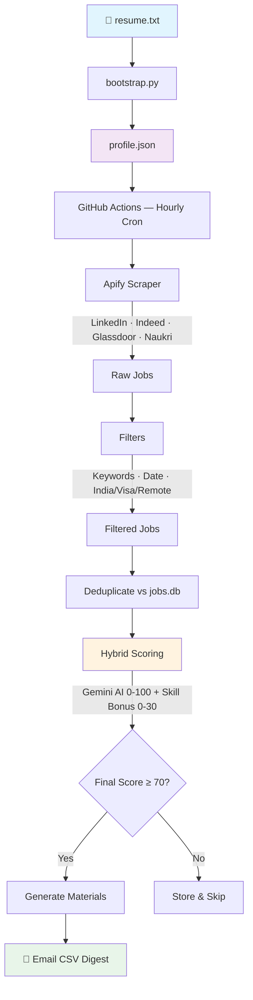

# job-search-bot

An automated job search pipeline that runs on GitHub Actions every hour. It scrapes job postings across LinkedIn, Indeed, Glassdoor, and Naukri, applies hybrid scoring (Gemini AI semantic fit + deterministic skill-alignment bonus), filters for India-based or visa-sponsored roles, generates tailored resume bullets and a cover letter for strong matches, and emails you a CSV digest.

It never auto-submits applications. Every email gives you the apply link and tailored materials — you review and act yourself.

---

## How it works



### Pipeline detail

```
python bootstrap.py        ← run once (or after updating resume.txt)
        │
        ▼ profile.json
        │  ├── anchor_skill (e.g. "Ruby on Rails")
        │  ├── primary_skills, target_titles, keywords
        │  └── search_terms, location, seniority
        │
GitHub Actions (hourly cron)
        │
        ▼
  fetch_new_postings()
  ├── Apify  → LinkedIn, Indeed, Glassdoor, Naukri    (primary, pay-per-result)
  ├── Greenhouse API → direct-to-company              (free, unlimited)
  └── Lever API      → direct-to-company              (free, unlimited)
        │
        ▼  keyword filter → date filter (POSTED_WITHIN_DAYS)
           location filter (local / remote-India / visa sponsorship)
           sort by posted date (most recent first)
        │
        ▼  deduplicate against jobs.db
        │
        ▼  HYBRID SCORING:
        │    ┌─────────────────────────────────────┐
        │    │ Gemini semantic score (0–100)        │
        │    │ + Skill alignment bonus (0–30):     │
        │    │   anchor_skill in title   → +20     │
        │    │   anchor_skill in desc    → +10     │
        │    │   primary_skill in title  → +5 each │
        │    │ = Final score (capped at 100)       │
        │    └─────────────────────────────────────┘
        │
        ├── final_score < 70  → store, skip email
        └── final_score ≥ 70  → generate tailored materials → email CSV
```

---

## Project structure

```
job-search-bot/
├── bot/                     # The job search pipeline (unchanged)
│   ├── __init__.py          # Package init with sys.path shim
│   ├── main.py              # Orchestrator — fetch → hybrid score → email
│   ├── bootstrap.py         # One-time resume analyser → profile.json
│   ├── discovery.py         # Job fetching, filtering, and sorting
│   ├── db.py                # SQLite helpers (dedup, persistence, flush)
│   ├── config.py            # Two-layer config: profile.json + infrastructure
│   ├── requirements.txt     # Bot Python dependencies
│   ├── .env.example         # Environment variable template
│   └── resume.txt.example   # Template for new users
├── mcp-wrapper/             # MCP protocol adapter (new)
│   ├── pyproject.toml       # Package config (depends on bot/)
│   ├── server.py            # MCP stdio server
│   ├── tools.py             # Tool definitions and handlers
│   └── README.md            # MCP-specific docs
├── pyproject.toml           # Root — optional extras point to mcp-wrapper
├── README.md                # This file
├── resume.txt               # Your resume (gitignored)
├── profile.json             # Generated by bootstrap (gitignored)
└── .github/
    └── workflows/
        └── hourly.yml       # GitHub Actions hourly cron
```

---

## Setup

### 1. Clone and install

```bash
git clone https://github.com/vinayjrao96/job-search-bot.git
cd job-search-bot
python -m venv .venv && source .venv/bin/activate
pip install -r bot/requirements.txt
```

### 2. Add your resume

```bash
cp bot/resume.txt.example resume.txt
# Edit resume.txt with your actual resume in plain text
```

### 3. Get your API keys

| Key | Service | Cost | How to get |
|-----|---------|------|------------|
| `GEMINI_API_KEY` | Google AI Studio | Free (cascades 8 models, ~3,000+ req/day) | [aistudio.google.com/apikey](https://aistudio.google.com/apikey) |
| `APIFY_API_KEY` | Apify | $0.003 / job scraped | [console.apify.com/account/integrations](https://console.apify.com/account/integrations) |
| `GMAIL_ADDRESS` | Gmail sender address | Free | Your Gmail address |
| `GMAIL_APP_PASSWORD` | Gmail app password | Free | [myaccount.google.com/apppasswords](https://myaccount.google.com/apppasswords) — requires 2FA |

### 4. Configure environment

```bash
cp bot/.env.example .env
# Fill in your keys
```

### 5. Bootstrap from your resume

```bash
cd bot
python bootstrap.py
```

This calls Gemini once to extract:
- **`anchor_skill`** — your single defining technology (e.g. "Ruby on Rails")
- **`primary_skills`** — supporting skills (AWS, Node.js, etc.)
- **`search_terms`** — natural-language job search queries
- **`keywords`** — filter keywords
- **`location`**, **`seniority`**, **`email`**

All written to `profile.json`. Re-run whenever you update your resume.

### 6. Run locally

```bash
cd bot
python main.py          # normal run
python main.py --flush  # reset DB and re-score everything fresh
```

Or set `FLUSH_DB=true` in your `.env` for a one-time flush.

---

## MCP Integration (AI Agents)

The MCP wrapper exposes the bot's pipeline as tools for AI agents (Claude, Kiro, etc.).

### Design principles

- **No auto-apply** — The bot never submits job applications. Every tool surfaces information; the human decides and acts.
- **Wrapper-only storage** — MCP-specific data (bookmarks, interviews, reminders) lives in `wrapper.db`, completely separate from the bot's `jobs.db`.
- **Local-only stdio** — The MCP server communicates via stdin/stdout. No network ports, no remote access.
- **No credential exposure** — `run_health_check` reports "set"/"MISSING" but never returns actual API key values.

### Install

```bash
pip install -e "./mcp-wrapper"
```

### Configure your MCP client

**Kiro / VS Code** (`.kiro/settings/mcp.json`):

```json
{
  "mcpServers": {
    "job-search": {
      "command": "python",
      "args": ["mcp-wrapper/server.py"],
      "cwd": "/path/to/job-search-bot"
    }
  }
}
```

**Claude Desktop** (`claude_desktop_config.json`):

```json
{
  "mcpServers": {
    "job-search": {
      "command": "python",
      "args": ["/path/to/job-search-bot/mcp-wrapper/server.py"],
      "env": {
        "GEMINI_API_KEY": "your-key",
        "APIFY_API_KEY": "your-key",
        "GMAIL_ADDRESS": "your@gmail.com",
        "GMAIL_APP_PASSWORD": "your-app-password"
      }
    }
  }
}
```

### Tool reference (all 25 tools)

#### Tier 1 — Live (wraps existing bot functions)

| Tool | Status | Description |
|------|--------|-------------|
| `search_jobs` | ✅ Live | Fetch and filter jobs from Apify + Greenhouse/Lever |
| `score_job` | ✅ Live | Score a single job with hybrid scoring (Gemini + skill bonus) |
| `run_pipeline` | ✅ Live | Full pipeline: fetch → score → email CSV digest |
| `flush_db` | ✅ Live | Reset database for fresh scoring |
| `bootstrap` | ✅ Live | Regenerate profile.json from resume.txt |
| `generate_cover_letter` | ✅ Live | Generate tailored resume bullets + cover letter |
| `get_platforms` | ✅ Live | Show configured job boards and search terms |
| `get_analytics` | ✅ Live | Scoring analytics: totals, averages, by source |
| `get_saved_jobs` | ✅ Live | Retrieve scored jobs filtered by time and score |
| `run_health_check` | ✅ Live | Validate API keys, files, DB connectivity |

#### Tier 2 — Live (wrapper-local storage)

| Tool | Status | Description |
|------|--------|-------------|
| `save_job` | ✅ Live | Bookmark a job for later reference |
| `unsave_job` | ✅ Live | Remove a job from bookmarks |
| `get_job_details` | ✅ Live | Get full details of a scored job by ID or URL |
| `update_profile` | ✅ Live | Update a field in profile.json (whitelisted keys only) |
| `export_data` | ✅ Live | Export all scored jobs as JSON or CSV |

#### Tier 3 — Implemented / Stubs

| Tool | Status | Description |
|------|--------|-------------|
| `add_interview` | ✅ Live | Track an upcoming interview |
| `get_upcoming_interviews` | ✅ Live | List upcoming interviews |
| `set_reminder` | ✅ Live | Set a follow-up reminder |
| `get_reminders` | ✅ Live | Get active reminders |
| `dismiss_reminder` | ✅ Live | Mark a reminder as done |
| `get_bot_status` | ✅ Partial | Get last run time and configuration |
| `compare_jobs` | 🔜 Stub | Compare jobs side by side |
| `get_company_info` | 🔜 Stub | Company enrichment data |
| `pause_bot` | 🔜 Stub | Pause the hourly cron |
| `resume_bot` | 🔜 Stub | Resume the hourly cron |

See [mcp-wrapper/TOOLS.md](mcp-wrapper/TOOLS.md) for full parameter docs and examples.
See [mcp-wrapper/SECURITY.md](mcp-wrapper/SECURITY.md) for the security audit.

---

## Hybrid scoring explained

Every job gets two scores combined:

| Component | Range | How it works |
|-----------|-------|-------------|
| **Gemini score** | 0–100 | Semantic fit vs your full resume (title, stack, seniority, location) |
| **Skill bonus** | 0–30 | Deterministic: anchor_skill in title +20, in desc +10, primary_skills in title +5 each |
| **Final score** | 0–100 | `min(gemini + bonus, 100)` |

This ensures jobs matching your strongest skill always rank above tangentially related roles, even if both get high semantic scores.

---

## Gemini model cascade

The bot tries 8 models in order. When one hits its daily quota (429), it moves to the next:

```
gemini-2.0-flash → gemini-2.0-flash-lite → gemini-2.5-flash-lite →
gemini-2.5-flash → gemini-2.5-pro → gemini-3.5-flash →
gemini-3.1-flash-lite → gemini-3-flash-preview
```

Combined free-tier capacity: ~3,000+ calls/day. You won't hit "all exhausted" in normal use.

---

## Email digest format

**Subject:** `[Job Digest] N strong match(es) of M new role(s) — crawled YYYY-MM-DD HH:MM UTC`

**Attachment:** `jobs_digest.csv` with columns:

| Column | Description |
|--------|-------------|
| Final Score | Gemini score + skill bonus (capped at 100) |
| Gemini Score | Pure semantic fit score |
| Skill Bonus | Deterministic bonus from anchor/primary skill match |
| Title | Job title |
| Company | Company name |
| Location | Job location |
| Remote | Yes / No |
| Visa Sponsorship | Yes / No |
| Posted Date | YYYY-MM-DD |
| Source | linkedin / indeed / glassdoor / naukri |
| Status | strong_match / below_threshold / score_error |
| Apply URL | Direct link to apply |
| Reasoning | Gemini's 2–3 sentence fit summary |

---

## Deploy to GitHub Actions

### 1. Push to GitHub

```bash
git remote add origin https://github.com/<your-username>/job-search-bot.git
git push -u origin main
```

### 2. Add secrets (Settings → Secrets and variables → Actions → Repository secrets)

| Secret | Content |
|--------|---------|
| `GEMINI_API_KEY` | Your Gemini API key |
| `APIFY_API_KEY` | Your Apify token |
| `GMAIL_ADDRESS` | Gmail sender address |
| `GMAIL_APP_PASSWORD` | 16-character app password |
| `RESUME_TXT` | Full contents of your `resume.txt` |
| `PROFILE_JSON` | Full contents of your `profile.json` |

### 3. (Optional) Add FLUSH_DB variable

Settings → Secrets and variables → Actions → **Variables** tab → `FLUSH_DB` = `true`

Set this to flush the DB on the next run. Remove it after.

### 4. Trigger a test run

**Actions → Hourly Job Search → Run workflow**

---

## DB flush

Reset the database to re-score all jobs from scratch:

```bash
# Locally
python main.py --flush

# Or via env var
FLUSH_DB=true python main.py

# In CI: add FLUSH_DB=true as a GitHub Actions variable, trigger workflow, then remove it
```

---

## Infrastructure settings (config.py)

| Setting | Default | What it does |
|---------|---------|-------------|
| `POSTED_WITHIN_DAYS` | `7` | Only include jobs posted in the last N days |
| `SCORE_THRESHOLD` | `70` | Minimum final score for strong match |
| `APIFY_JOB_BOARDS` | `linkedin, indeed, glassdoor, naukri` | Boards to scrape |
| `APIFY_MAX_RESULTS` | `20` | Results per board per term (controls cost) |
| `APIFY_INTERVAL_HOURS` | `1` | How often Apify runs (1 = every cron trigger) |
| `FILTER_INTERNATIONAL` | `True` | Enforce location/visa rules |
| `GEMINI_MODELS` | 8 models | Cascade list — edit to add/remove models |

---

## Cost estimate

| Service | Default config | Monthly estimate |
|---------|---------------|-----------------|
| Apify | 5 terms × 4 boards × 20 results × 24 runs/day | ~$390/month (lower with fewer terms or higher interval) |
| Gemini | scoring + materials | Free (model cascade) |

**To reduce cost:** raise `APIFY_INTERVAL_HOURS` to 6 (~$65/month) or 12 (~$32/month), lower `APIFY_MAX_RESULTS`, or trim `APIFY_SEARCH_TERMS`.

---

## Adding a new job source

1. Add a `fetch_<source>(...)` function in `bot/discovery.py` returning:
   `{id, title, company, location, url, text, posted_date, is_remote, visa_sponsorship, source}`
2. Prefix `id` with a unique short code (e.g. `wb_` for Workable)
3. Call it inside `fetch_new_postings()` with a `try/except`
4. Add required config to `bot/config.py` / `bot/.env.example`

---

## Adding a new interface (Discord, Slack, etc.)

The monorepo is structured for multiple interfaces:

1. Create a new directory (e.g. `discord-bot/` or `slack-app/`)
2. Import from the `bot` package: `from bot.main import run, score_job`
3. Add its own `pyproject.toml` or `requirements.txt`
4. The bot code stays untouched — each interface is a thin adapter
